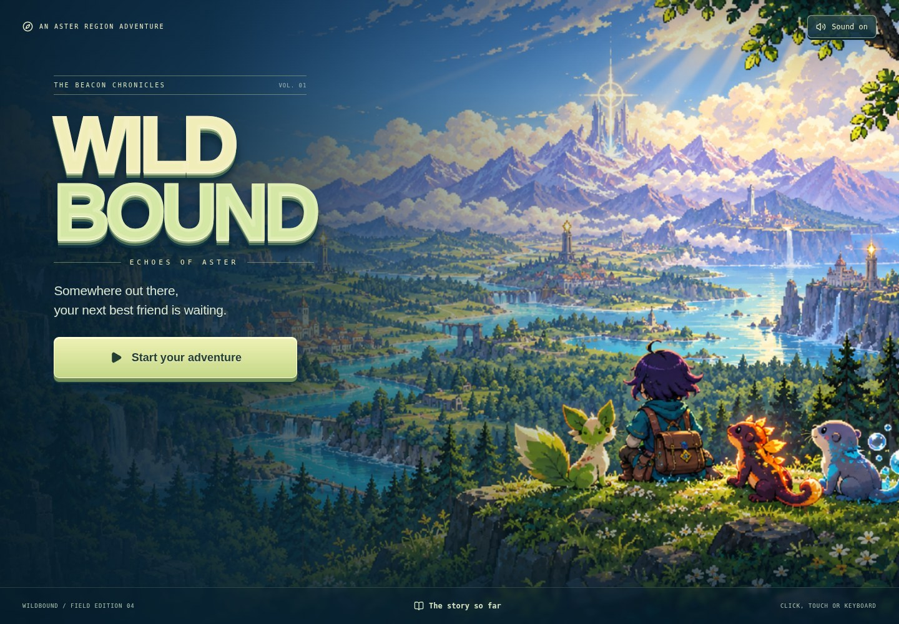
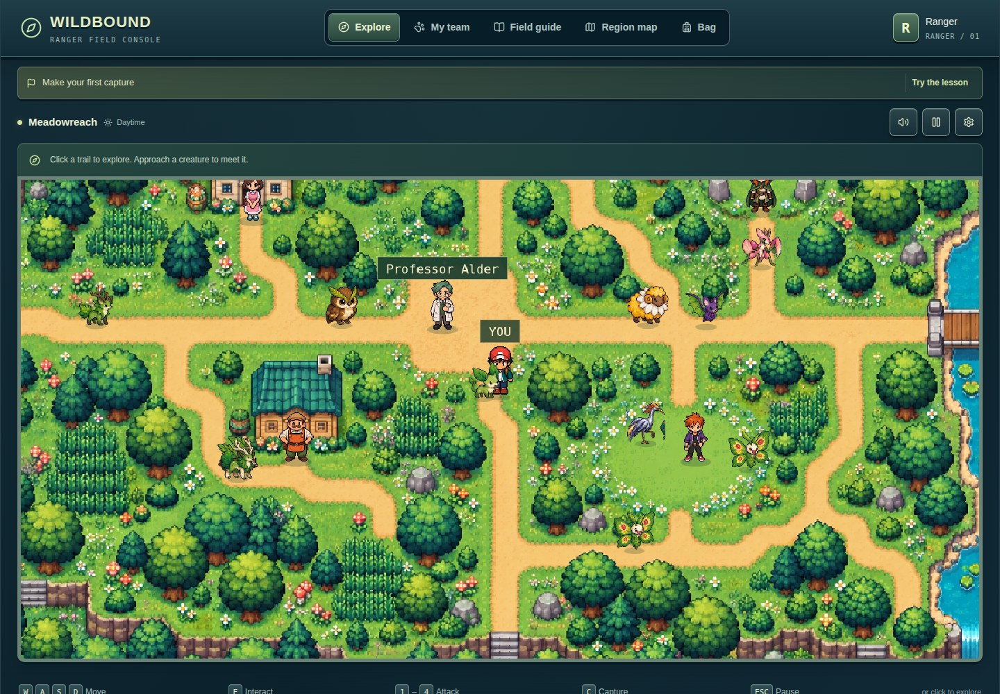
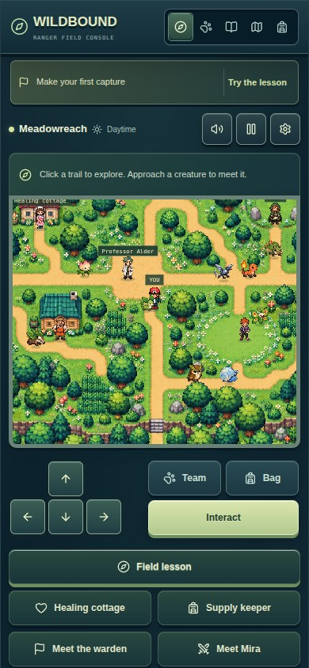
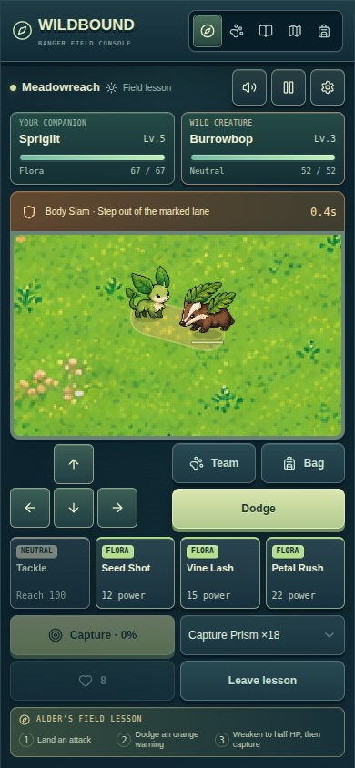
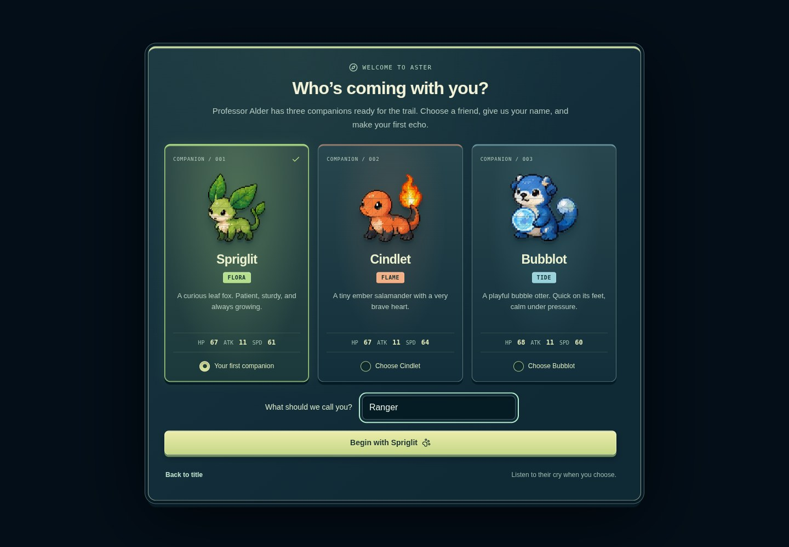
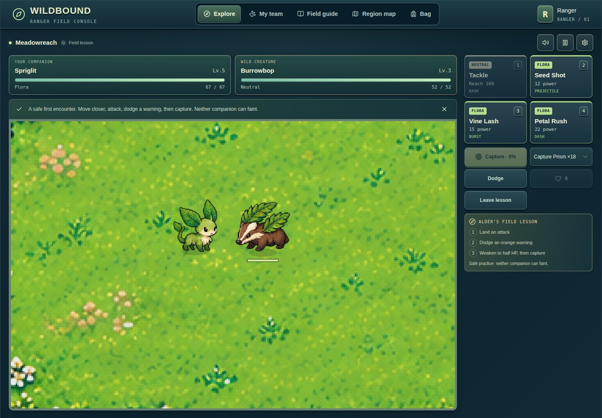
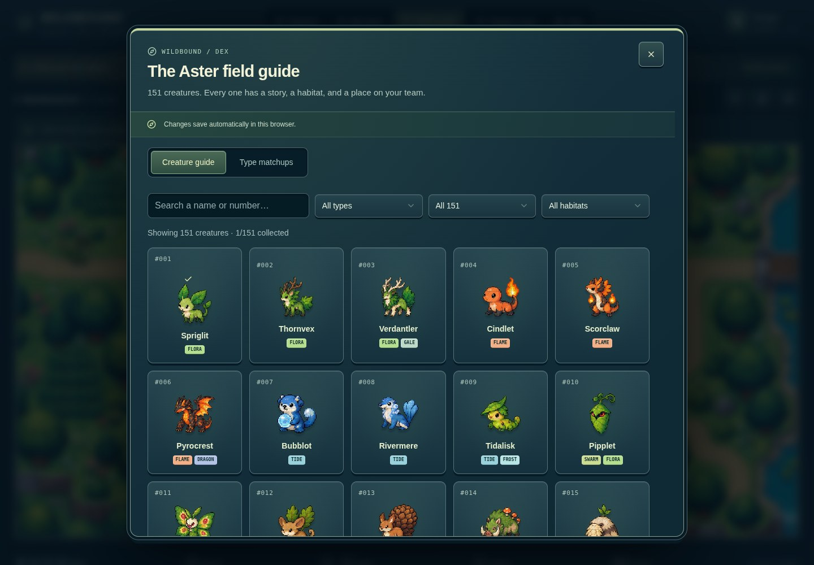
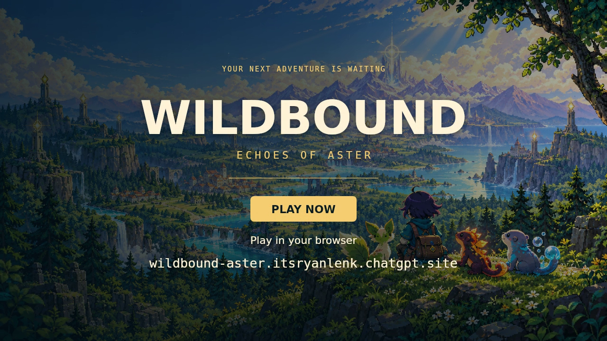

<div align="center">

# Wildbound: Echoes of Aster

### A little companion. A vast world. Eight voices waiting to be heard.

**A retro-inspired, real-time creature adventure by Ryan Lenk / itsryanlenk.**

[**Play Wildbound**](https://wildbound-aster.itsryanlenk.chatgpt.site) · [**Screenshots**](#screenshots) · [**How to play**](#how-to-play) · [**Saves**](#your-save-your-adventure) · [**Downloads**](#downloads-and-publication-status) · [**Trailer**](#launch-trailer)

<a href="https://wildbound-aster.itsryanlenk.chatgpt.site"></a>

<kbd>151 original creatures</kbd> &nbsp; <kbd>Real-time battles</kbd> &nbsp; <kbd>8 beacon badges</kbd> &nbsp; <kbd>Browser-local saves</kbd>

</div>

<!-- IMPORT-STATUS:START -->
> [!TIP]
> **Field Edition 04 is available to play, clone, and download.** The repository contains the complete prebuilt game, original runtime assets, editable launch-trailer production, documentation, and distribution tests. [Download the verified v0.4.0 release](https://github.com/itsryanlenk/wildbound-aster/releases/tag/v0.4.0). The original unbundled game source is not part of this recovered distribution.
<!-- IMPORT-STATUS:END -->

## Welcome to Aster

The eight beacons once kept Aster in harmony. Now their songs are disappearing, wild creatures are growing restless, and the Hollow Choir is following a plan nobody fully understands.

Professor Alder gives you a young companion and a field guide. Your childhood friend Mira follows the Choir's trail while you earn the wardens' trust, restore the lost tones, and discover what waits beyond the First Beacon.

**Wildbound is about exploring with a companion, not waiting for your turn.** Creatures roam visibly through the world. In battle, you move, dodge warning zones, manage attack cooldowns, and decide when to risk a capture. Build a team, learn its strengths, and keep collecting after the story ends.

## At a glance

| Part of the adventure | Field Edition 04 includes |
|---|---|
| Creatures | **151 original species**, with types, stats, habitats, rarities, descriptions, and cries |
| Combat | **Real-time movement and battles**, four equipped attacks, cooldowns, enemy warnings, dodging, and status effects |
| Team building | A **six-creature party**, reserve storage, switching, experience, and **75 evolution links** |
| Elemental variety | **16 types** and **65 attacks**, with an in-game matchup guide |
| Campaign | **Nine regions**, eight warden badge challenges, rival encounters, a finale, and postgame legendary encounters |
| Capture | Three grades of capture prism; health and status affect the displayed catch chance |
| Presentation | Pixel-art environments, articulated creature animation, directional ranger walking and idle, an animated title illustration, and story cinematics |
| Sound | Regional and battle music, **151 creature cries**, combat effects, interface feedback, and reward themes |
| Controls | Keyboard, mouse, and touch layouts for desktop and smaller screens |
| Progress | Browser-local saving, export/import backups, and optional offline installation in the standalone build |

These features describe the existing game build. This repository publication pass does not claim to have newly implemented or exhaustively retested every feature.

## Screenshots

These are **real screenshots of the public game**, taken through its interface with a fresh, synthetic **Ranger** adventure. They are not concept art, wireframes, or renders of a proposed interface. Click an image to view it at full size.

### Explore Meadowreach

[](docs/images/desktop.jpg)

The world is the main play area. Travel tools, objectives, and feedback surround it, while conversations and notifications use designated space rather than a floating toast stack over the action.

### Play in a portrait touch layout

<table>
<tr>
<td align="center" width="50%"><strong>Exploration</strong></td>
<td align="center" width="50%"><strong>First battle</strong></td>
</tr>
<tr>
<td align="center"><a href="docs/images/phone.jpg"></a></td>
<td align="center"><a href="docs/images/phone-battle.jpg"></a></td>
</tr>
</table>

*The phone views use touch-enabled Chromium emulation at 390 × 844, not photographs of physical phones. The desktop views are 1440 × 1000. Reduced-motion mode was enabled for the still captures.*

<details>
<summary><strong>More screenshots: choose a companion, enter battle, and open the field guide</strong></summary>

### Choose your first companion

[](docs/images/companions.jpg)

### Battle in real time

[](docs/images/desktop-battle.jpg)

### Meet the creatures of Aster

[](docs/images/field-guide.jpg)

</details>

The gallery lives in this repository under `docs/images/`, rather than depending on expiring chat attachments. Its [capture manifest](docs/images/capture-manifest.json) records the method, viewport sizes, and image checksums. The **Capture README gameplay gallery** workflow can reproduce the screenshots from anonymous sessions without using a player's personal save.

## How to play

### Your first few minutes

Open the hosted game, choose **Start your adventure**, give your ranger a name, and select a companion. Professor Alder offers a safe field lesson that introduces attacking, reading a warning, dodging, weakening a creature, and throwing a prism. You can also choose to explore on your own.

Visit the healing cottage, look around Meadowreach, and prepare for Fern's first beacon challenge. The objective strip and journal help you find the next step; the region map handles travel as the campaign opens up.

### Pick the companion that feels right

| Companion | Type | Meet your new friend |
|---|---|---|
| **Spriglit** | Flora | A curious leaf fox that plants tiny seeds wherever its springy paws land. |
| **Cindlet** | Flame | An ember salamander whose little tail flame warms abandoned nests. |
| **Bubblot** | Tide | A bubble otter that carries its favorite smooth pebble inside a water sphere. |

### Move, read, react

You control your active companion during a fight. Keep an eye on attack range, cooldowns, health, and the enemy's warning. A move that is ready is not necessarily a move that can reach its target. Position first, attack when there is an opening, and use a dodge instead of trying to absorb everything.

Switch companions to change your options. Choose the four equipped moves that fit the creature and the encounter. The field guide includes a matchup chart, so remembering all sixteen types is optional.

<details>
<summary><strong>The sixteen elemental types</strong></summary>

Neutral · Flora · Flame · Tide · Volt · Stone · Gale · Frost · Venom · Swarm · Iron · Mind · Shade · Spirit · Dragon · Astral

Types can have strengths and resistances; some species have two types. Check the in-game chart and the current battle's effectiveness information instead of assuming every creature of a familiar shape has the same weaknesses.

</details>

### Make a new friend

Approach a visible wild creature to begin an encounter. Lower its health, take advantage of applicable status effects, and choose a capture prism. The interface displays the current catch chance, and stronger prism grades improve your options. A full party does not make a successful capture disappear: additional companions go to reserve storage.

Capturing and collecting are separate from simply winning a fight. Avoid knocking out a creature you are trying to befriend.

### Grow your team

In Field Edition 04, each healthy party member receives the full XP reward from a defeated opponent or successful capture; the reward is not divided among the party. Fainted companions and creatures in reserve do not receive that XP. A newly captured, healthy creature that joins the party can also receive the capture reward.

**Growth Candy** raises its selected healthy companion one level outside battle. Invalid targets and capped companions do not consume the item. Evolution follows the species' threshold, updates its legal moves and field-guide record, and restores health. **Level 60 is the cap.**

Use the party, reserve, habitat, and collection filters to organize your companions and track species you have not yet recorded.

## The beacon trail

Each warden's challenge restores a different tone. The eight badges open the way to the final region.

| Region | Warden | Badge | Theme |
|---|---|---|---|
| **Meadowreach** | Fern | Sprout | Open fields, woodland paths, and your first companion |
| **Emberfall** | Kael | Cinder | Old forges beneath a restless volcano |
| **Tideglass Coast** | Nori | Tideglass | A harbor, tidal paths, and a silent lighthouse |
| **Stormvale** | Tessa | Thunder | High grass and skies full of sparks |
| **Frostmere** | Ivo | Aurora | A frozen archive beneath the northern lights |
| **Ironroot** | Brann | Ironheart | A living forest wrapped around an ancient foundry |
| **Duskhollow** | Sable | Twilight | Lantern trails and remembered songs |
| **Astral Summit** | Orin | Zenith | An observatory beneath a sea of stars |

<details>
<summary><strong>After the eighth badge — mild progression spoilers</strong></summary>

The restored tones open **The First Beacon**, the ninth region and the setting of the final confrontation with Conductor Vey. Completing the story unlocks legendary wild encounters, including Asterion at the First Beacon. Exploration and collection continue after the ending, with a complete **151/151** field guide as a further goal.

</details>

## Controls

| Action | Keyboard / mouse | Touch |
|---|---|---|
| Move | **WASD**, arrow keys, or click a destination | Direction pad or tap a destination |
| Interact | **E** or click a character/creature | Interact button or tap |
| Attack | **1–4**; **Space** uses the first move | Attack cards |
| Dodge | **Shift** | Dodge button |
| Capture | **C** | Capture control and prism selector |
| Switch companion | **Q** | Companion row or Team |
| Tonic | **H** | Tonic or Bag |
| Retreat | **R** | Retreat button |
| Pause | **Esc** | Pause button |
| Map / Bag | **M** / **B** | Navigation buttons |

Menus pause the world. The portrait layout places controls below the arena; compact landscape layouts arrange them beside it. Unusual screen sizes, browser zoom settings, and specific devices may still expose issues—please report the screen size and orientation when reporting a layout problem.

## Your save, your adventure

**Players do not share one server save.** Progress is stored in the browser profile for the website address being used.

To make a backup, open **Settings → Export save backup**. To restore it elsewhere, use **Import save backup** and select that JSON file. Export before clearing browser data or changing devices.

| Situation | What to expect |
|---|---|
| Return to the same address in the same browser profile | Continue the local adventure, provided the site data remains available |
| Open another browser or another device | A separate local save; import a backup to move your progress |
| Move from the hosted game to a self-hosted copy | A different website origin, so progress does not transfer automatically |
| Use a temporary/private browsing session | Progress may disappear when the session is closed |
| Clear website storage | The local save may be removed; restore from an exported backup |

Treat exported saves as personal files. They can contain your chosen player name and progress. **Do not attach your own save or an unredacted diagnostic dump to a public issue.** Use a fresh test adventure instead.

## Sound, motion, and comfort

The build contains **225 original audio assets**: 151 creature cries, 14 music tracks, 55 sound effects, and five reward themes. Music changes with the region or battle context; the field guide lets you preview creature cries.

Settings offers separate **Master**, **Music**, **Battle & World**, **Creature Cries**, and **Interface** volume controls. Browser audio may wait for a click, tap, or key press before starting.

Reduced-motion support and a story transcript are included. Enemy warnings and important feedback are visible, not only audible. These features are not a claim of formal accessibility certification or complete assistive-technology coverage.

## Downloads and publication status

**The game and launch materials are published as ordinary GitHub Release attachments.** These links do not depend on a chat session.

| Download | Purpose |
|---|---|
| [Standalone game ZIP](https://github.com/itsryanlenk/wildbound-aster/releases/download/v0.4.0/wildbound-game-v0.4.0.zip) | Complete prebuilt game for local play or static hosting |
| [Launch trailer — MP4](https://github.com/itsryanlenk/wildbound-aster/releases/download/v0.4.0/wildbound-launch-trailer.mp4) | Finished 50-second, 720p launch film |
| [Orchestral soundtrack — MP3](https://github.com/itsryanlenk/wildbound-aster/releases/download/v0.4.0/wildbound-orchestral-score.mp3) | Aster Takes Flight, the standalone orchestral score |
| [Launch poster — PNG](https://github.com/itsryanlenk/wildbound-aster/releases/download/v0.4.0/wildbound-launch-poster.png) | Launch artwork with the branded play address |
| [Editable trailer project — ZIP](https://github.com/itsryanlenk/wildbound-aster/releases/download/v0.4.0/wildbound-trailer-source.zip) | Production scripts, source clips, storyboard, and audio |
| [SHA-256 checksums](https://github.com/itsryanlenk/wildbound-aster/releases/download/v0.4.0/SHA256SUMS.txt) | Integrity hashes for the release downloads |

[View the release and its complete asset list](https://github.com/itsryanlenk/wildbound-aster/releases/tag/v0.4.0). The automatically generated GitHub source archives contain this distribution repository, not the missing original game-engine source checkout.

## Local play and self-hosting

Clone this repository or download the standalone game ZIP. The prebuilt game is ready to serve; no game compilation step is required.

### From the populated repository

Use **Node.js 22 or newer**:

```sh
git clone https://github.com/itsryanlenk/wildbound-aster.git
cd wildbound-aster
npm start
```

Open **http://localhost:8080**. The included server binds to the local machine. Running the prebuilt game does not require `npm install`, a database, an API key, or a ChatGPT account.

With Python instead:

```sh
python3 -m http.server 8080 --bind 127.0.0.1 --directory game
```

From the extracted standalone ZIP, run its included `node serve.mjs`, or serve that extracted folder using Python's HTTP server. **Do not launch this module build by double-clicking `index.html` as a `file://` page.**

### Host a static copy

Upload the standalone archive's extracted contents to a static host, retaining the relative layout of `index.html`, `assets/`, `art/`, `audio/`, `sw.js`, `offline-release.json`, and the supplied license notices. The prepared distribution supports a domain root or a subdirectory.

These commands validate and package the checked-in distribution:

```sh
npm test
npm run verify
npm run audit:privacy
npm run build
```

`dist/` is the resulting static site. **This build command packages an existing compiled game; it does not recompile the missing original game source.** GitHub Pages is a possible destination, but it must be configured and successfully deployed separately; no Pages deployment is claimed here.

### Optional offline installation

In the **standalone build**, open **Settings → Download for offline play** while connected and wait for completion. This requires HTTPS or localhost. The prepared runtime inventory is about **61 MiB**, so allow enough storage and time for the download.

Reopen the same address to use its installed files offline. Offline installation is not a substitute for exporting a save backup, and it should not be assumed to be enabled on every hosted version. Updates wait for existing game tabs to close rather than replacing files in the middle of play.

## Launch trailer

[](https://github.com/itsryanlenk/wildbound-aster/releases/download/v0.4.0/wildbound-launch-trailer.mp4)

[Watch or download the MP4](https://github.com/itsryanlenk/wildbound-aster/releases/download/v0.4.0/wildbound-launch-trailer.mp4) · [Download the editable project](https://github.com/itsryanlenk/wildbound-aster/releases/download/v0.4.0/wildbound-trailer-source.zip)

**Aster Takes Flight** accompanies a 50-second launch film at **1280 × 720 / 30 fps**, supplied as **H.264 video with AAC stereo audio**. The film combines the animated opening artwork, exploration, battle sequences, capture, evolution, and the game's sound effects and cries.

Its source clips were captured deterministically from the actual game engine using controlled fixtures and inputs. It is an edited launch film, **not an uninterrupted browser playthrough**. The orchestral score was composed and synthesized locally; no ElevenLabs generation is claimed for the supplied master.

The production package includes a storyboard, source clips, event records, score synthesis, sound mixing, native Canvas/FFmpeg rendering, and an optional Remotion composition. The delivered master used **Canvas and FFmpeg**.

<details>
<summary><strong>Edit or re-render the supplied trailer project</strong></summary>

Install Node.js 22+, Python 3, and FFmpeg/ffprobe from their official sources. From the `trailer/` directory:

```sh
npm install --omit=optional
python -m pip install -r requirements.txt
python render-all.py
```

To regenerate the orchestral score as well:

```sh
python render-all.py --regenerate-score
```

`storyboard.json` controls the edit. `trailer-art.mjs` draws the editorial titles, `splash-motion.mjs` animates the opening artwork, and `compose-orchestral-score.py` generates the score.

The optional Remotion route has additional dependencies and separate licensing. Editing the supplied clips does not require the missing original game checkout; **recapturing gameplay from source does**. No font binaries, browser executables, or third-party executables are included in the reviewed package. Using different system fonts can change title wrapping, so visually review a re-render.

</details>

## Project structure and source status

The repository layout is:

```text
wildbound-aster/
├── game/          Prebuilt playable distribution, artwork, and audio
├── trailer/       Editable film, source clips, storyboard, and score
├── scripts/       Local server, integrity checks, packaging, and publication
├── tests/         Distribution and server checks
├── docs/          Guides, provenance, privacy notes, and screenshots
├── licenses/      Notices for identified bundled dependencies
├── .github/       Repository automation and support templates
├── LICENSE        MIT license for original project material
└── NOTICE.md      Third-party licensing and attribution scope
```

**The original unbundled game TypeScript/React source and its package lock were not recovered.** The available game package is a compiled distribution, accompanied by editable trailer production. It is playable and hostable, but this is not a full game-engine source checkout.

The existing build uses React for the interface, Motion for UI animation, Remotion for the cinematic player, and PixiJS with a Canvas fallback for creature rendering. Recover the original source and lockfile before making major engine changes or claiming a complete dependency inventory.

## What has been checked

The repository's screenshot workflow completed the title, companion-selection, exploration, field-guide, and guided-battle flows on desktop and in a touch-enabled portrait viewport. Its images and capture manifest are committed to the repository.

The recovered package also has prior packaging verification covering its runtime file inventory, 151 sprite files, 151 cry files, checksum manifests, unsafe paths, privacy exclusions, and local-server behavior. Historical Field Edition 04 release notes report gameplay and progression regression checks; those are separate from the screenshot workflow and are not claimed to have been rerun by it.

**Known limits:** physical iOS/Android testing is not exhaustive; screenshots cannot certify animation smoothness, game balance, save reliability on every browser, or the absence of all layout defects. The missing unbundled source limits reproducible engine development. The release import additionally verifies downloadable asset bytes and checksums; it is not a new full gameplay or physical-device certification.

## Troubleshooting

| Problem | First thing to check |
|---|---|
| No music or sound | Interact with the page, then check the mixer and browser/tab mute state |
| A save seems missing | Confirm the same website address and browser profile; import your backup if you moved |
| Local launch shows a blank page | Use an HTTP server rather than opening `index.html` directly; ensure all relative assets are present |
| Offline play is not ready | Use the standalone build on HTTPS or localhost and let the full download finish |
| A menu or control is clipped | Report browser, viewport size, orientation, and zoom; attach a screenshot without private content |
| A GitHub download is unavailable | Open the v0.4.0 Releases page and select the named attachment; check network or browser download restrictions |

## Contributing and reporting problems

Useful contributions include clear bug reproductions, desktop and phone layout checks, packaging improvements, documentation, and trailer edits. For engine changes, recover the original source checkout first rather than presenting minified-bundle patches as a maintainable substitute.

A helpful issue explains what you expected, what happened, how to reproduce it, the relevant build, and the browser/device configuration. Use a synthetic ranger name and crop unrelated tabs or personal information out of screenshots. **Never post credentials or your personal save backup.**

For security concerns, read [SECURITY.md](SECURITY.md) before posting. The project does not promise a support response time or universal device compatibility.

## License, credits, and privacy

Original project material is released under the **[MIT License](LICENSE)**, © 2026 **Ryan Lenk**, to the extent rights are held. **Bundled dependencies retain their own licenses. Remotion is not relicensed as MIT.** Read [NOTICE.md](NOTICE.md) and preserve the supplied third-party notices when redistributing the game.

Wildbound is an independent creature-collecting adventure, not an official Pokémon game, and is not affiliated with Nintendo, Game Freak, or The Pokémon Company.

The **Ryan Lenk / itsryanlenk** brand and the existing play address are intentional public identifiers. The screenshot gallery uses anonymous sessions and a synthetic ranger, not a personal save. File sanitization does not erase information already present in Git history; see [the privacy note](docs/PRIVACY.md) for that distinction.

---

<div align="center">

**Your next companion is somewhere out there.**

[**Begin your adventure in Aster →**](https://wildbound-aster.itsryanlenk.chatgpt.site)

</div>
